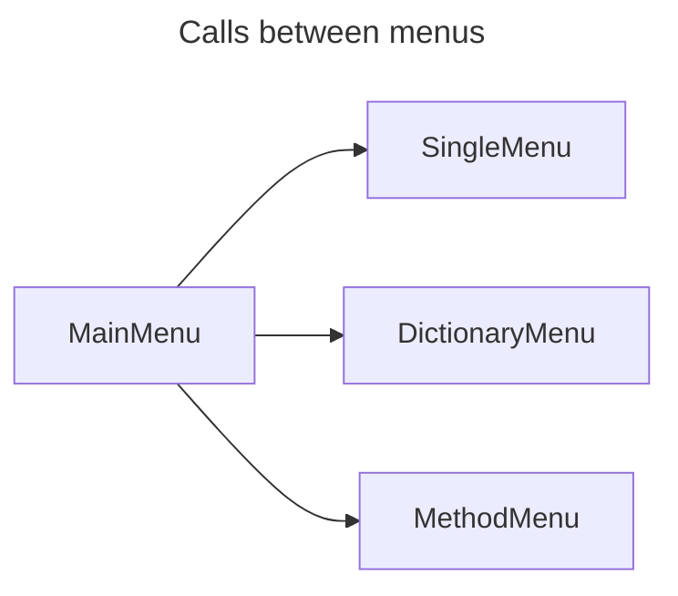
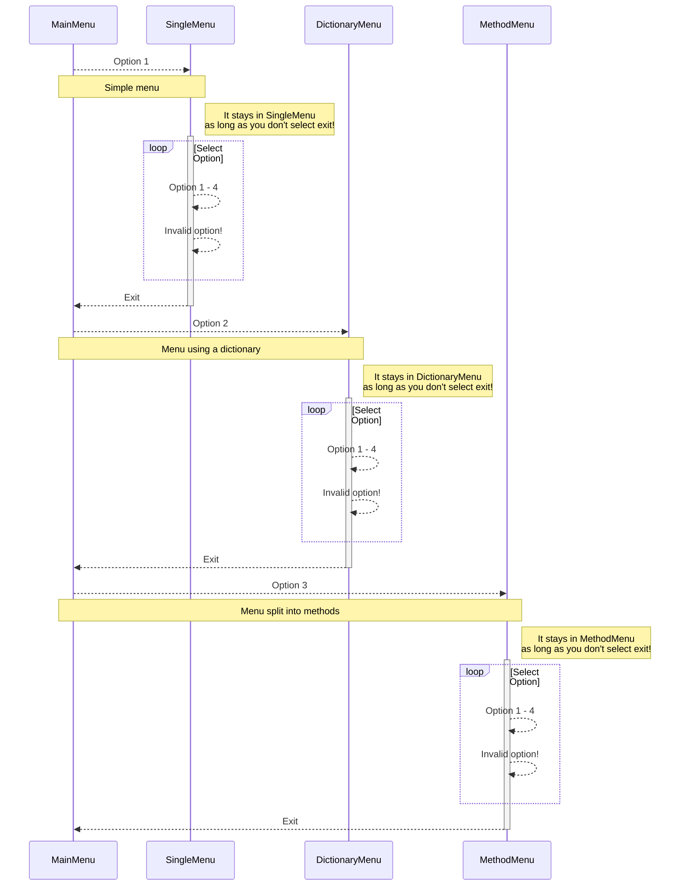

# Test Menus

Project with a console application that creates menus in different ways.

> **Note:** This application is a test to learn how to locate the elements of the VSCode development environment. I will also be practising documenting projects with Markdown and possibly using actions in Git Hub.

## Phases of project

The construction of this project will be divided into different phases.

### Pase I

A main menu will be created with three options; basic code with hardcode strings will be used, and we will divide it into different projects.

| Project         | Description                                        |
|-----------------|----------------------------------------------------|
| MainMenu        | This is the main project of the solution.          |
| SingleMenu      | Build a simple menu.                               |
| DictionaryMenu  | Build a menu by loading options from a dictionary. |
| MethodMenu      | Build a menu by separating the code into methods.  |

Here is a diagram of the menu options:

### Phase II

Added the ability to load menu options from a file; each menu option in the main menu will load a file with different structures, and two additional options are also added.

* Option to add a menu by uploading an XML file.
* Option to add a menu by uploading a JSON file.

### Phase III

Interfaces and structures will be added to apply some Design Patterns applicable to this project.

### Phase IV

The main menu options will be decoupled, and the project will be modified to dynamically load the different menu options by searching for DLLs that implement a specific interface.
