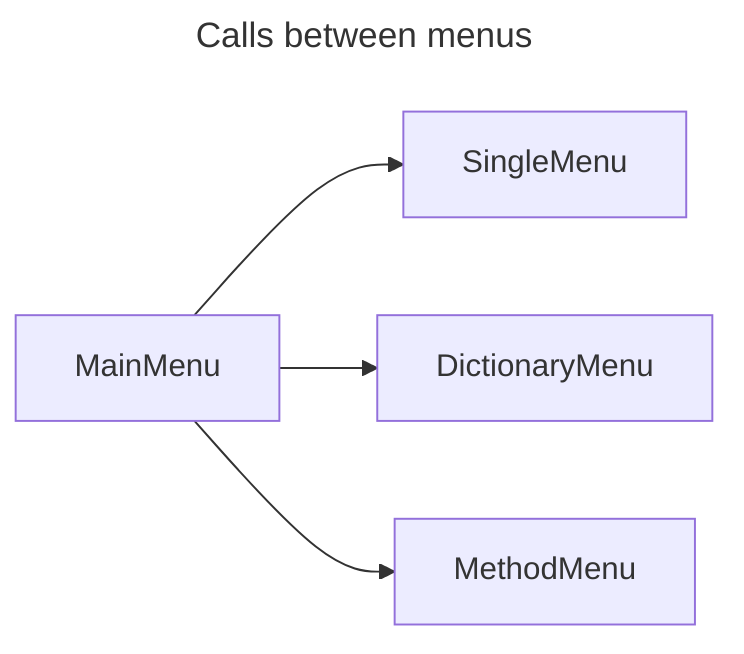
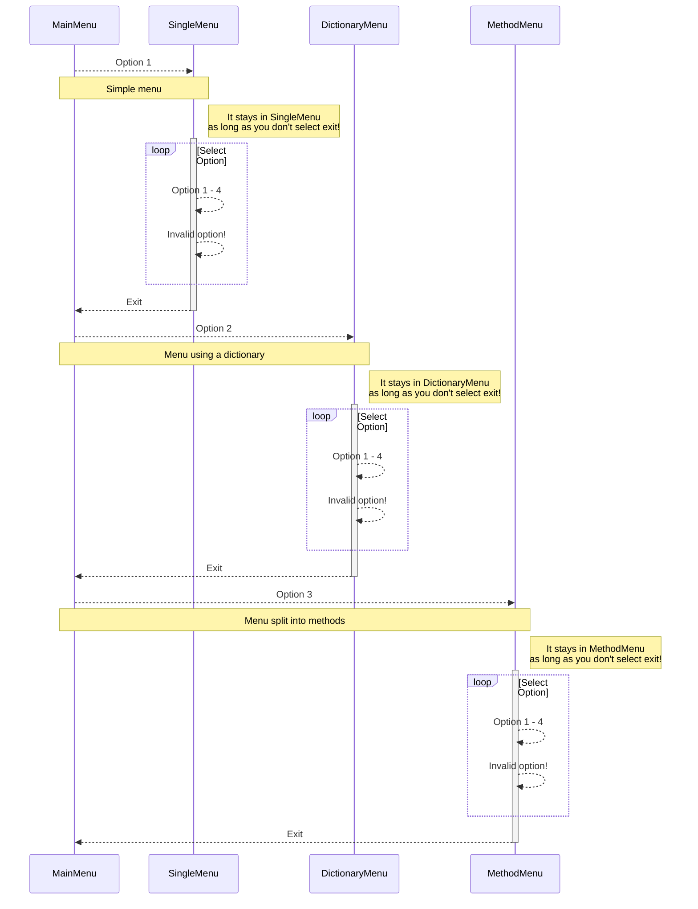

# Test Menus

Project with a console application that creates menus in different ways.

> [!NOTE] 
> This application is a test to learn how to locate the elements of the VSCode development environment. I will also be practising documenting projects with Markdown and possibly using actions in Git Hub.

## Table of content

- [Test Menus](#test-menus)
  - [Table of content](#table-of-content)
  - [Phases of project](#phases-of-project)
    - [Pase I](#pase-i)
    - [Phase II](#phase-ii)
    - [Phase III](#phase-iii)
    - [Phase IV](#phase-iv)

## Phases of project

The construction of this project will be divided into different phases.

### Pase I

A main menu will be created with three options; basic code with hardcode strings will be used, and we will divide it into different projects.

| Project         | Description                                        |
|-----------------|----------------------------------------------------|
| MainMenu        | This is the main project of the solution.          |
| SingleMenu      | Build a simple menu.                               |
| DictionaryMenu  | Build a menu by loading options from a dictionary. |
| MethodMenu      | Build a menu by separating the code into methods.  |

Here is a diagram of the menu options:

```mermaid
---
title: Calls between menus
---
graph LR;
    MainMenu --> SingleMenu;
    MainMenu --> DictionaryMenu;
    MainMenu --> MethodMenu;
```

```mermaid
sequenceDiagram;
    participant Main as MainMenu;
    participant Single as SingleMenu;
    participant Dictionary as DictionaryMenu;
    participant Method as MethodMenu;
    Main-->>Single: Option 1;
    Note over Main,Single: Simple menu;
    Note right of Single: It stays in SingleMenu<br/>as long as you don't select exit!
    activate Single;
    loop Select Option
        Single-->>Single: Option 1 - 4;
        Single-->>Single: Invalid option!;
    end
    Single-->>Main: Exit;
    deactivate Single;
    Main-->>Dictionary: Option 2;
    Note over Main,Dictionary: Menu using a dictionary;
    Note right of Dictionary: It stays in DictionaryMenu<br/>as long as you don't select exit!
    activate Dictionary;
    loop Select Option
        Dictionary-->>Dictionary: Option 1 - 4;
        Dictionary-->>Dictionary: Invalid option!;
    end
    Dictionary-->>Main: Exit;
    deactivate Dictionary;
    Main-->>Method: Option 3;
    Note over Main,Method: Menu split into methods;
    Note right of Method: It stays in MethodMenu<br/>as long as you don't select exit!
    activate Method;
    loop Select Option
        Method-->>Method: Option 1 - 4;
        Method-->>Method: Invalid option!;
    end
    Method-->>Main: Exit;
    deactivate Method;
```

### Phase II

Added the ability to load menu options from files. Each existing option in the main menu now loads data from a different file structure, and two additional options were added.

* Option 1 reads a `:` separated file.
* Option 2 reads a `=` separated file.
* Option 3 reads a `,` separated file.
* Option 4 loads a menu from an XML file path entered by the user.
* Option 5 loads a menu from a JSON file path entered by the user.

Sample files are available in `src/MainMenu/MenuData` and copied automatically to output at build time.

### Phase III

Interfaces and structures will be added to apply some Design Patterns applicable to this project.

### Phase IV

The main menu options will be decoupled, and the project will be modified to dynamically load the different menu options by searching for DLLs that implement a specific interface.
